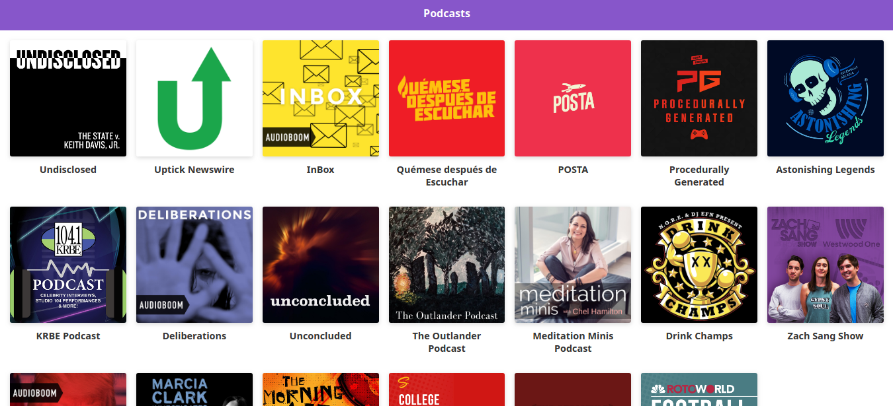

# Podcasts app from audioboom

App de podcasts integrada con el API de AudioBoom para aprender Next.js

## How does it work ?

Require Node.js 10

* `npm install` para instalar las dependencias.
* `npm run dev` para el entorno de desarrollo.
* `npm run build && npm start` para el entorno de producción.

## Liscense

MIT